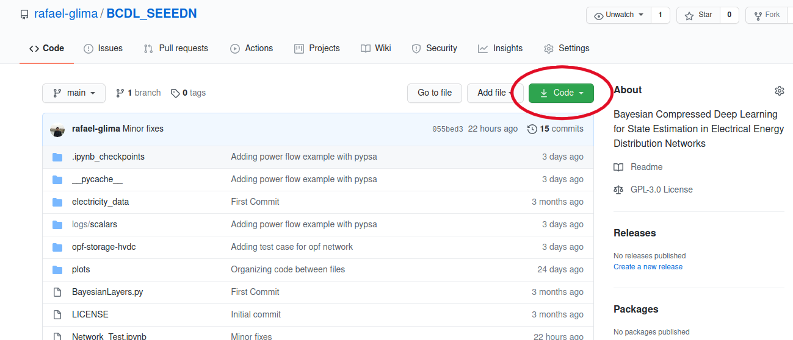
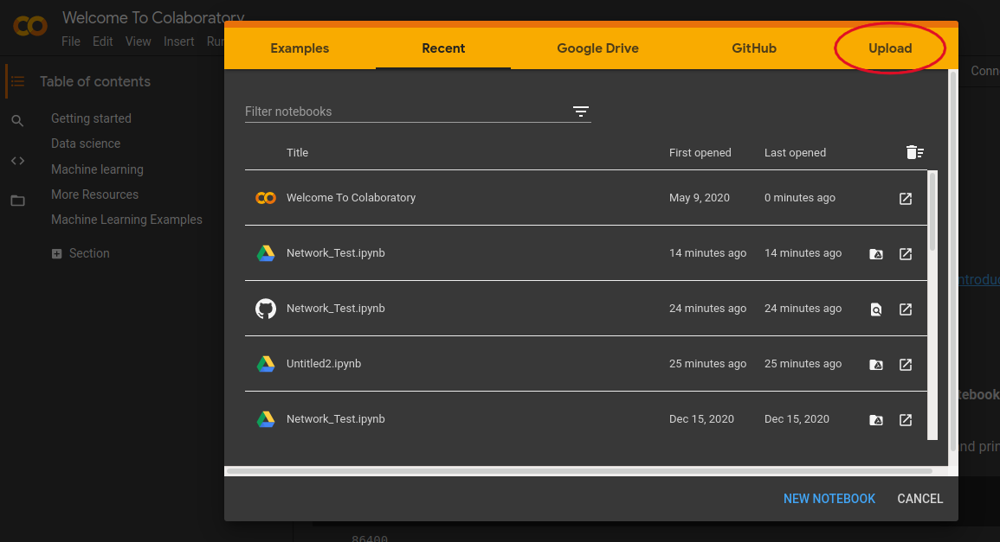
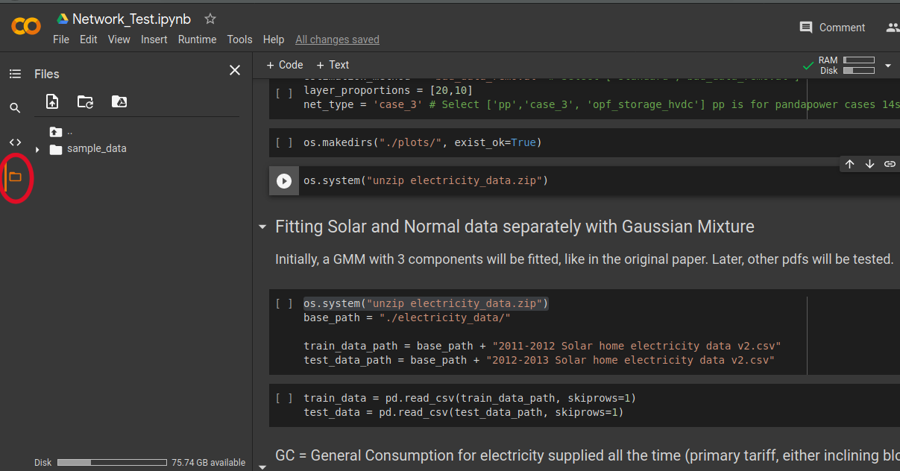
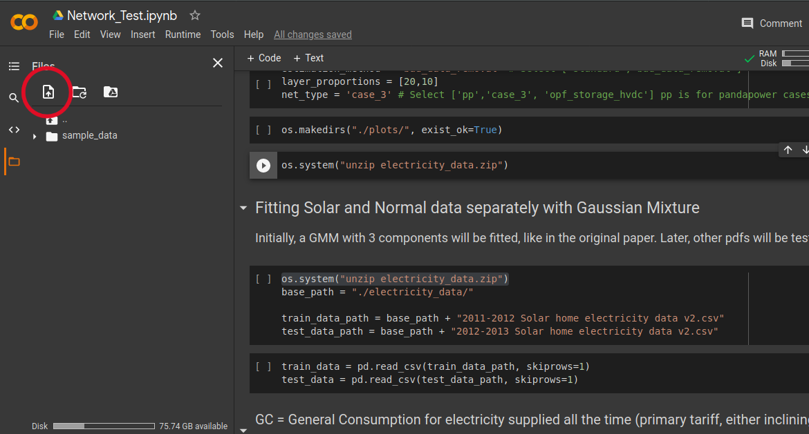

# BCDL_SEEEDN
Bayesian Compressed Deep Learning for State Estimation in Electrical Energy Distribution Networks

This repository contains the code and data for reproducing the experiments in the paper 
"Bayesian Compressed Deep Learning for State Estimation in Electrical Energy Distribution Networks"

The code is composed of a Jupyter notebook ("Network_Test.ipynb"), along with auxiliary Python files and dataset.

Step 1: Download the zip file of the repository and unzip it in your local computer:

Step 2: Upload the "Network_Test.ipynb" notebook:

Step 3: Click the button shown in the image below to switch to the files folder:

Step 4: Use the other button shown below to upload all the auxiliary files, along with the zip folders:

Step 5: Now, sequentially run all the cells, choosing the parameters, 
such as network test case, kappa, or layer multiplying factors, to get the corresponding result in the last cell.
